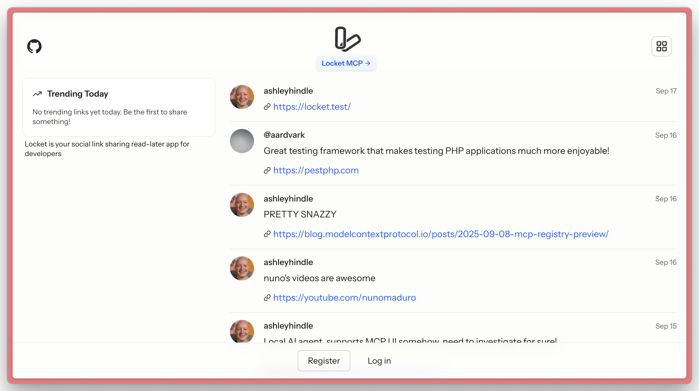

# Locket

Locket is a demo application to show [Laravel MCP](https://github.com/laravel/mcp) capabilities.

It combines a read-later app with a link sharing social feed.

Locket allows users to share interesting links, manage their 'to read' list of links, and bookmark links shared by others. Locket allows users to do this through the web, API, and MCP.



## Important Files

To learn the most from Locket and Laravel MCP, take a look at these directories & files:

- `routes/ai.php`
- `app/Mcp/Servers/Locket.php`
- `app/Mcp/Tools/`
- `app/Mcp/Actions/`
- `routes/api.php`

## API

Locket provides a REST API for programmatic access. See the [API Documentation](API.md) for detailed endpoint information and usage examples.

### Getting an API Token

1. Log in to your Locket account
2. Go to Settings → Profile (`/settings/profile`)
3. Create a new personal access token in the API Tokens section
4. Use the token in the `Authorization: Bearer YOUR_TOKEN` header for API requests

## Auth

This app uses [Laravel Passport](https://laravel.com/docs/passport) for both MCP OAuth authentication and API token authentication.

Users can manage their API tokens in the user profile settings area (`/settings/profile`).

## MCP

Locket comes with an MCP server located at http://locket.test/mcp, with tools, a resource, and a prompt.

# Setup

```shell
composer install
cp .env.example .env
php artisan passport:keys

npm install
npm run build
```

# HTTP Notes

Many AI agents use Node which comes with its own certificate store, meaning they'll fail to connect to an MCP server on `https://`. We recommend leaving Locket on `http://` locally for testing with AI agents, and using `https://` on production.
